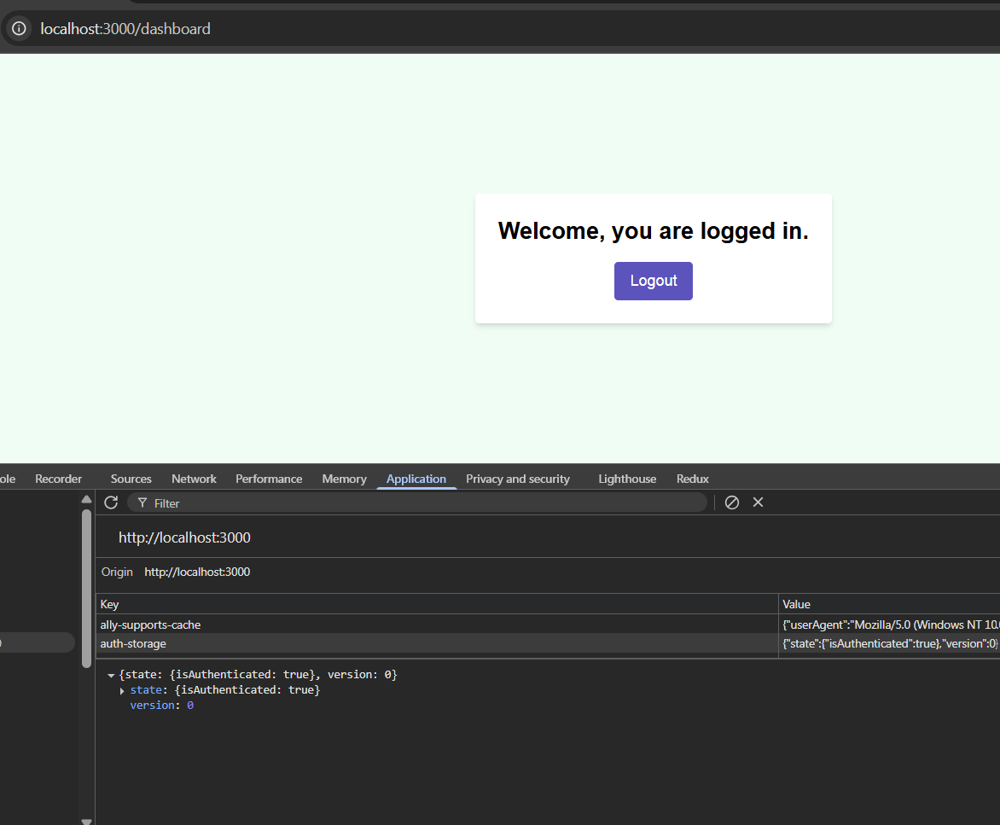

## Start

npm i
npm run dev

## Features

## Login Page

• Form validation: required fields, email format
• Only accept:
o Email: test@visionexdigital.com.au
o Password: password123

• Show error message if credentials are incorrect
• On success, store session in Zustand and redirect to dashboard

## Dashboard Page (Protected Route)

• Message: “Welcome, you’re logged in.”
• Logout button → clears session and redirects to login Routing
• Use Next.js app routing
• Redirect unauthenticated users to the login page

## Bonus (Optional):

• Persist login with localStorage
• Responsive layout matching Figma
• Use of clean, reusable components

## UI Flow

